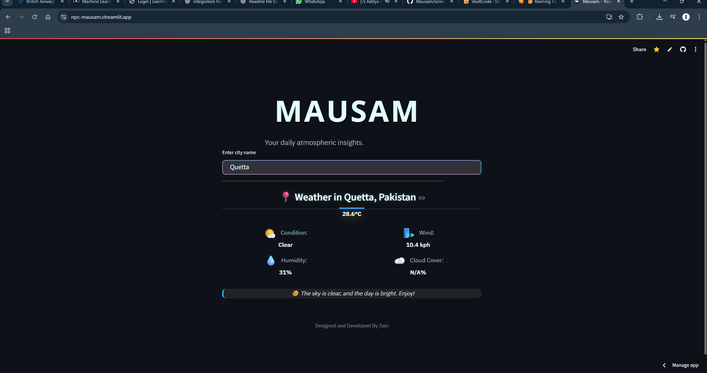

# Mausam 🌦️

**A weather app that doesn't just tell you the forecast — it sets the mood.**

Mausam (Urdu/Hindi for "weather") pulls live conditions for any city and pairs them with a matching quote and ambient soundscape — rain sounds for a rainy day, a breezy track when it's windy, calm cloud ambience for an overcast sky. It's a weather app built to *feel* like the weather, not just report it.

🔗 **Live app:** [mausam.streamlit.app](https://mausam.streamlit.app)

---

## What it does ✨

- 🌍 **Live weather for any city** — temperature, condition, humidity, and wind speed
- 💬 **Mood-matched quotes** — a different line for rain, clear skies, clouds, wind, mist, and snow
- 🎵 **Ambient sound on autoplay** — background audio that matches the current condition
- 🎨 **Custom-styled UI** — a dedicated weather card with custom fonts and dark theme styling

## How it works 🧩

```
city name → WeatherAPI.com → condition + temp + humidity + wind
                                   ↓
                    matched quote + matched ambient sound
```

Mausam calls [WeatherAPI.com](https://www.weatherapi.com) for real-time conditions, then maps the returned condition text (rain, clear, cloud, wind, mist, snow) to a corresponding quote and an autoplaying audio clip, rendered through a custom Streamlit component.

## Tech stack 🛠️

| Layer | Tech |
|---|---|
| App framework | Streamlit |
| Weather data | WeatherAPI.com |
| Audio | Base64-embedded autoplay via Streamlit components |
| Styling | Custom CSS, Google Fonts (IBM Plex Sans, Open Sans) |

## Running it locally 🚀

```bash
git clone https://github.com/zain-the-npc/Mausam.git
cd Mausam
pip install -r requirements.txt
```

Get a free API key from [WeatherAPI.com](https://www.weatherapi.com), then create a `.env` file in the project root (copy `.env.example` and fill it in):

```
WEATHER_API_KEY=your-key-here
```

Run it:

```bash
streamlit run app.py
```

## Screenshot 📸



---

Designed and developed by Zain.
